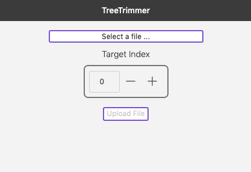
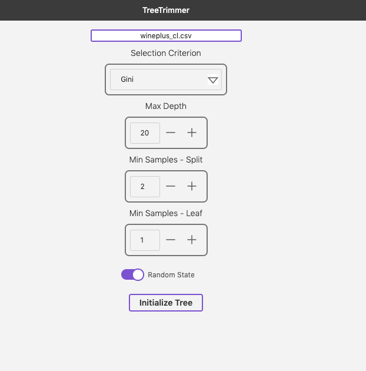
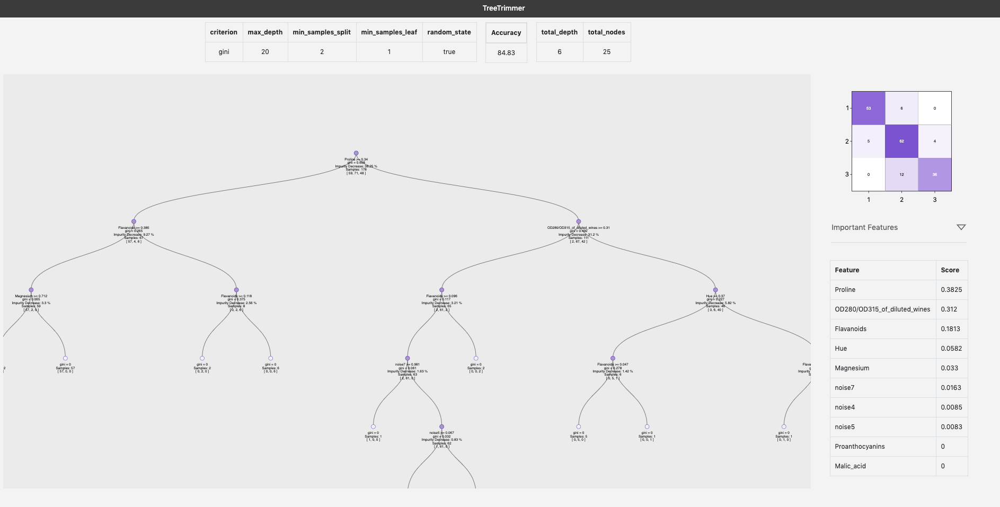
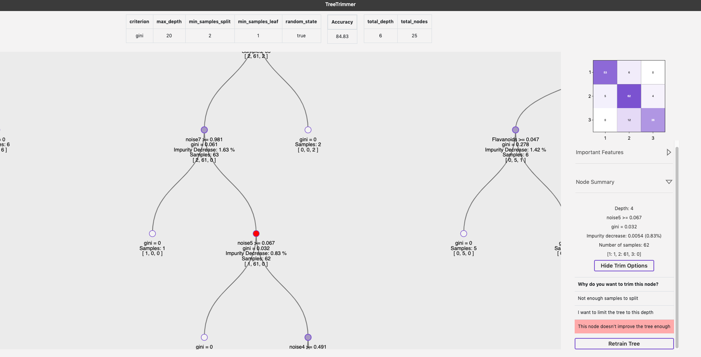

# interactiveDecisionTree

Start Screen:


Initialization Screen:


Initialized Tree:


Node Trim Options:


## Set up

To run docker images, you will need Docker Desktop.

To run locally you will need Node v10.18.1 and Python 3.6.5 (or compatible versions)

### Env Files

#### React

The React app requires ```.env``` files to run on your machine and expects the file to be in ```environments``` directory.

Right now the config is simple. Create the following in ```react-app/environments/.env.local``` and ```react-app/environments/.env```:

```bash
API_HOST=http://localhost:5000
DECISION_TREE_NS=decision-trees
FILES_NS=files
```

#### Flask

For local development you need ```flask-app/.env```

```bash
FLASK_ENV=development
FLASK_HOST=localhost
FLASK_PORT=5000
UPLOAD_FOLDER=file_storage/
STORAGE_BASE=storage/
```

#### Docker

Create ```.env``` file in root with desired tags. Tags are picked up by docker-compose, build scripts and individual run scripts:

```bash
UI_BUILD=0.0.1
API_BUILD=0.0.1
```

## Running the App

### Run in Docker

```bash
./build-all && docker-compose up
```

UI can be viewed a [localhost:3000](http://localhost:3000/), swagger docs for API at [localhost:5000/api/v1](http://localhost:5000/api/v1)

### Run Locally (separate shells)

```bash
cd react-app/
npm install
npm start
```

```bash
cd flask-app/
pip install -r requirements.txt
./dev-run.sh
```
